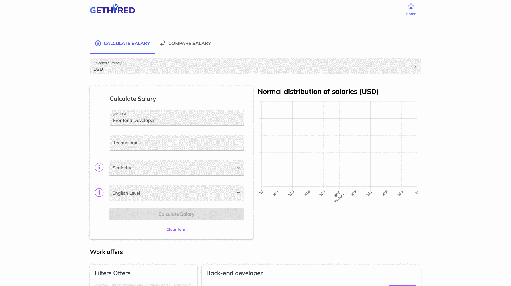

# Job Placement | Salaries [C8] 💸💸💸

In salaries you can calculate your salary, compare your salary range with other profiles and when searching for your job you can negotiate your salary. 💚 💰

## Demo Salaries 🚀

[View Demo](https://salaries.get-hired.work/)

## Demo Job Placement Cell 🚀

[View Demo](https://get-hired.work/)

## Overview 🔖

## About Project 📈

This project is part of the Job Placement cell. He also belongs to cohort 8 of Platzi Master 💚

## Technologies 🔧

-   [React.js](https://reactjs.org/)
-   [Redux](https://redux.js.org/)
-   [Mui](https://mui.com/)
-   [@master-c8/commons](https://www.npmjs.com/package/@master-c8/commons)
-   [@master-c8/icons](https://www.npmjs.com/package/@master-c8/icons)
-   [@master-c8/theme](https://www.npmjs.com/package/@master-c8/theme)
-   [Vercel](https://vercel.com/)
-   [Webpack](https://webpack.js.org/)

## Design System 🪄

You can design system [here](https://www.figma.com/file/JbToDZz42lRNoZFCdDxya5/Standards?node-id=0%3A1)

## Setup and test ⚙️

First, clone the repository and install the dependencies

`yarn install`

Run the project with the script start

`yarn start`

The page will be loaded on `http://localhost:3000`

## Contributors 📧

-   [Yadu Lopez](https://www.linkedin.com/in/yadu-lopez/)
-   [Johan Perez](https://www.linkedin.com/in/johannpereze/)
-   [Kevin Farid](https://www.linkedin.com/in/kevfarid/)
-   [Emilio Sanchez](https://www.linkedin.com/in/emlez/)

## How to contribute

Thank you for being here, we're really happy you decided to contribute to the project.

Before you contribute to the project please make sure to read all items below.

-   [Code of Conduct](/CODE_OF_CONDUCT.md)
-   [Contributing Guide](/CONTRIBUTING.md)
